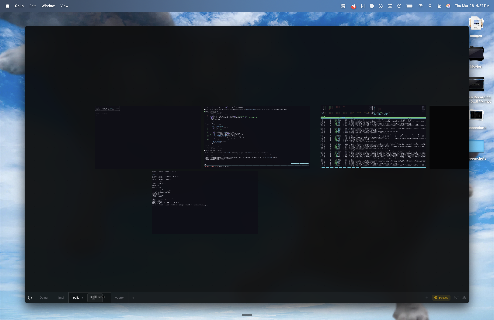
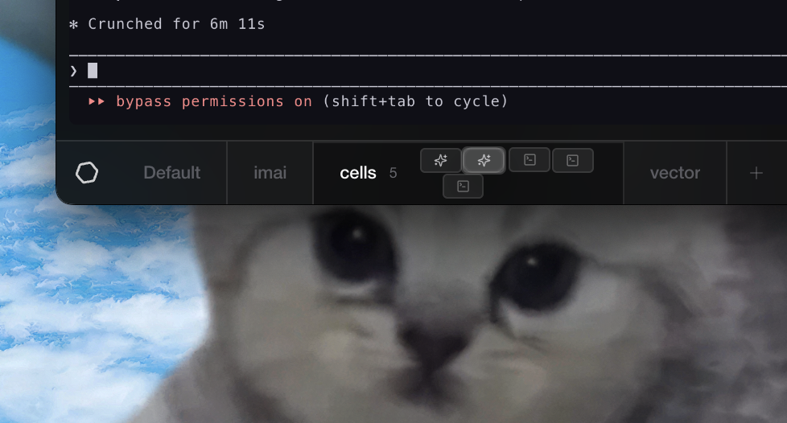

# Cells

Cells is a desktop workspace for arranging terminals and browser panes on an infinite canvas. It is built with Electron, React, Vite, and `ghostty-web`, and is currently focused on local macOS workflows.


*Arrange terminals, browsers, and agent sessions freely on an infinite canvas.*

## Features

- Infinite canvas for terminals and browser nodes
- Multiple saved projects with per-project layout state
- Command palette for fast workspace actions
- Optional local agent integration when `claude` or `codex` are available on `PATH`
- GitHub release packaging for desktop builds

### Terminal nodes


*Each terminal is a full Ghostty-powered PTY — here running an AI coding agent.*

### Browser panes


*Embed browser panes next to terminals for docs, dashboards, or any web content.*

### Command palette and project switching


*Switch between saved projects and run workspace actions from the command palette.*

### Project overview


*Quickly navigate between workspaces with live project thumbnails.*

### Agent integration with minimap


*The minimap provides a bird's-eye view of your canvas while agents work.*

## Status

Cells is early-stage software. Expect fast iteration, rough edges, and occasional breaking changes between tagged releases.

The app currently ships macOS release artifacts. Development on other platforms may work in places, but macOS is the maintained target today.

## Requirements

- Node.js 24 or newer
- pnpm 10 or newer
- macOS for the supported desktop experience

If native dependency rebuilds fail during install, install the Xcode Command Line Tools and retry.

## Getting Started

```bash
pnpm install
pnpm dev
```

`pnpm dev` sets `CELLS_DEV_ROOT` to `~/.cells-dev/` by default, so local app state and Chromium data stay isolated from the installed app. Set `CELLS_DEV_ROOT` yourself if you want that dev-only root somewhere else.

Useful commands:

- `pnpm lint`
- `pnpm format:check`
- `pnpm typecheck`
- `pnpm build`
- `pnpm changeset`

## Releasing

Tagged pushes that match `v*` trigger the GitHub release workflow and build macOS artifacts. Changesets are used for release notes and version tracking.

## Contributing

Start with [CONTRIBUTING.md](CONTRIBUTING.md). For behavior expectations, see [CODE_OF_CONDUCT.md](CODE_OF_CONDUCT.md). For security disclosures, use [SECURITY.md](SECURITY.md).

## Support

Usage questions and bug reports belong in the GitHub issue tracker. See [SUPPORT.md](SUPPORT.md) for the expected paths.

## License

Cells is licensed under the Apache License 2.0. See [LICENSE](LICENSE).
