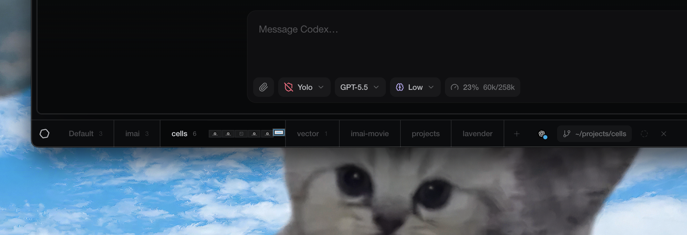
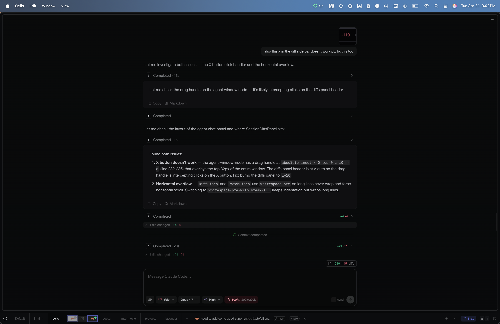
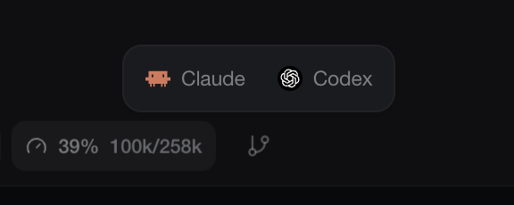
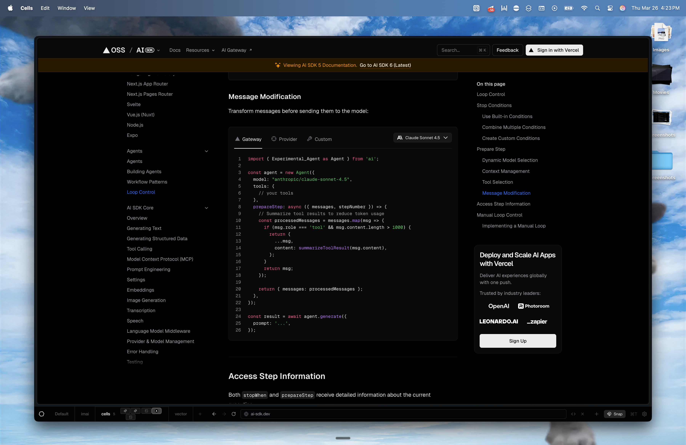
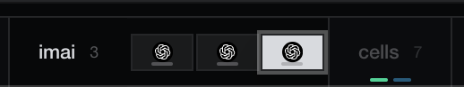
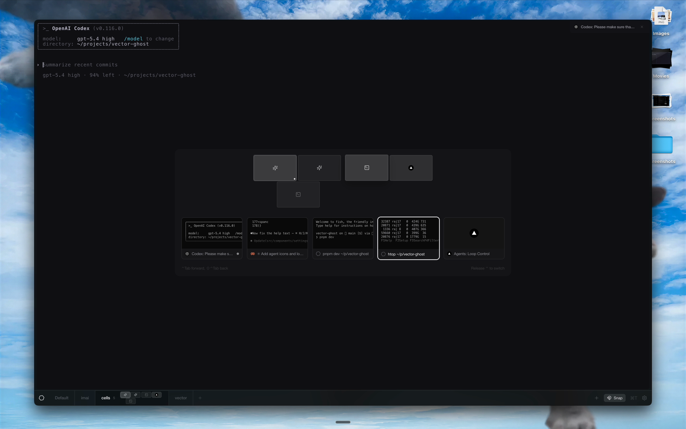
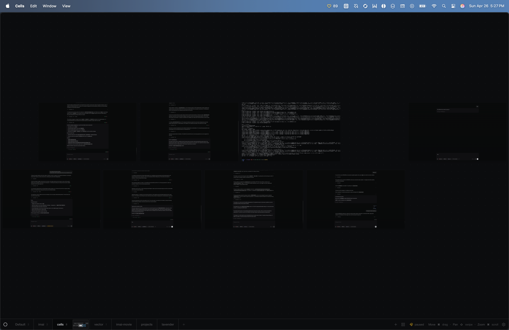

# Cells

Cells is a desktop workspace for arranging terminals and browser panes on an infinite canvas. It is built with Electron, React, Vite, and `ghostty-web`, and is currently focused on local macOS workflows.



## Features

- Infinite canvas for terminals and browser nodes
- Multiple saved projects with per-project layout state
- Command palette for fast workspace actions
- Keyboard-first navigation for terminals, overview mode, and project switching
- Dedicated agent windows with rich chat UI, provider switching, tool call grouping, diffs, and session branching
- GitHub release packaging for desktop builds

### Keyboard-first workflow

Cells focuses on one terminal at a time while keeping the rest of the workspace easy to reach from the keyboard. Open the command palette to create terminals, run commands, search, and launch agents; switch into overview mode to see every terminal at once; move directionally between terminals with vim-style navigation; cycle through terminals with the switcher overlay; and jump between open projects without managing windows by hand.

### Agent support

Cells includes dedicated agent windows with a rich chat UI for streaming turns, switching between Claude and Codex, tool call grouping, inline diffs, and a built-in diffs panel. Agent sessions can branch into another worktree so parallel ideas can continue in separate windows without losing context.

Agent and terminal windows can also run inside Git worktrees. The worktree manager is available from the focused window toolbar, terminal chrome, agent window menu, and command palette. It can create worktrees, show dirty/ahead/behind state, open terminals or agents in any worktree, move focused terminals, branch agent sessions into another worktree, reveal/copy paths, and safely remove worktrees after attached windows and uncommitted changes are handled.



*Dedicated agent window with streaming turns, tool groups, and inline progress states*



*Agent provider switcher for Claude and Codex*

### Browser panes

Embed browser panes alongside terminals, with browsing data scoped to each project.



### Minimap

Each project includes a minimap showing its nodes at a glance, plus activity indicators for work happening in other projects.



### Ctrl+Tab navigation

Navigate between nodes on the canvas with configurable Ctrl+Tab snapping — no need to manually manage windows.



### Canvas overview



## Credits

- [Craft Agents OSS](https://github.com/lukilabs/craft-agents-oss) — the in-canvas agent chat UI (message grouping, turn card, markdown rendering, composer toolbar, and most of the chat UX) is adapted from this project. Files that pull from it have a header comment pointing at the upstream source.
- [T3 Code](https://github.com/pingdotgg/t3code) — the unified-diff stat model that powers the Codex session diffs panel is adapted from T3 Code, and several of the agent-session performance patterns were informed by it.

## Status

Cells is early-stage software. Expect fast iteration, rough edges, and occasional breaking changes between tagged releases.

The app currently ships macOS release artifacts. Development on other platforms may work in places, but macOS is the maintained target today.

## Requirements

- Node.js 24 or newer
- pnpm 10 or newer
- macOS for the supported desktop experience

If native dependency rebuilds fail during install, install the Xcode Command Line Tools and retry.

## Getting Started

```bash
pnpm install
pnpm dev
```

`pnpm dev` sets `CELLS_DEV_ROOT` to `~/.cells-dev/` by default, so local app state and Chromium data stay isolated from the installed app. Set `CELLS_DEV_ROOT` yourself if you want that dev-only root somewhere else.

Useful commands:

- `pnpm lint`
- `pnpm format:check`
- `pnpm typecheck`
- `pnpm build`
- `pnpm changeset`

## Releasing

Tagged pushes that match `v*` trigger the GitHub release workflow and build macOS artifacts. Changesets are used for release notes and version tracking.

## Contributing

Start with [CONTRIBUTING.md](CONTRIBUTING.md). For behavior expectations, see [CODE_OF_CONDUCT.md](CODE_OF_CONDUCT.md). For security disclosures, use [SECURITY.md](SECURITY.md).

## Support

Usage questions and bug reports belong in the GitHub issue tracker. See [SUPPORT.md](SUPPORT.md) for the expected paths.

## License

Cells is licensed under the Apache License 2.0. See [LICENSE](LICENSE).
